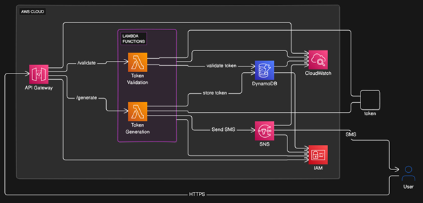

# KR91 - 2FA POC

This project contains the backend system for generating and validating single-use tokens using AWS services.

## Prerequisites

- AWS CLI installed and configured with the necessary permissions.
- Bash shell (e.g., Git Bash, WSL) for running the script on Windows.
- AWS CloudFormation.

## Steps to Set Up the Project

### Clone the Repository

Clone this repository to your local machine:

```bash
git clone https://github.com/AGhani-devOps/KR91-2FA.git
```

Navigate to the project directory:

```bash
cd kR91-2FA
```

### Run the Upload Script

Run the provided bash script to create the S3 bucket and upload the necessary files:

```bash
./uploadfiles.sh
```

### Deploy the CloudFormation Stack

1. Go to the AWS Management Console and navigate to the CloudFormation service.
2. Click on Create Stack and choose With new resources (standard).
3. Select Upload a template file, choose the cloudformation.yml file from this repository, and click Next.
4. Follow the prompts and click Next until you reach the end, then click Create stack.

### Get API URLs from CloudFormation Outputs

After the stack creation is complete, go to the Outputs section of the CloudFormation stack.

Copy the provided URLs for the GenerateTokenAPI and ValidateTokenAPI.

### Test the APIs using Postman

1. Open Postman and create a new POST request.
2. For the Generate Token endpoint, use the copied URL for the GenerateTokenAPI and add the path /t1/generatetoken.
3. For the Validate Token endpoint, use the copied URL for the ValidateTokenAPI and add the path /t2/validatetoken.
4. Send requests to these endpoints to test the token generation and validation functionality.

## Architecture Diagram


## Architecture Components

1. **API Gateway**: To expose endpoints for requesting and verifying tokens.
2. **Lambda Functions**: To handle the logic for generating and verifying tokens.
3. **DynamoDB**: To store tokens and their expiration times.
4. **SNS (Simple Notification Service)**: To send tokens via SMS or email.
5. **CloudWatch**: For logging, monitoring, and metrics.

## Code Excerpts

### 1. API Gateway and Lambda Integration
Create an API Gateway with two endpoints: `/request-token` and `/verify-token`.

### 2. Lambda Function to Generate Token
```python:src/backend/generate_token.py
import boto3
import random
import string
import time
import logging
import json
import os

dynamodb = boto3.client('dynamodb', region_name=os.environ['Region'])
sns = boto3.client('sns', region_name=os.environ['Region'])

logger = logging.getLogger()
logger.setLevel(logging.INFO)

def lambda_handler(event, context):
    logger.info('Event received: %s', event)
    
    try:
        if 'body' in event:
            body = json.loads(event['body'])
            user_id = body.get('userId')
            email = body.get('email')
        else:
            user_id = event.get('userId')
            email = event.get('email')
        
        if not user_id or not email:
            raise KeyError('userId or email')
    except KeyError as e:
        logger.error(f'Missing key in event: {e}')
        return {
            'statusCode': 400,
            'body': json.dumps({'message': f'Missing key: {e}'})
        }
    except json.JSONDecodeError as e:
        logger.error(f'Error parsing JSON: {e}')
        return {
            'statusCode': 400,
            'body': json.dumps({'message': 'Invalid JSON format'})
        }
    
    token = ''.join(random.choices(string.ascii_uppercase + string.digits, k=6))
    expiration_time = int(time.time()) + 300

    dynamodb.put_item(
        TableName=os.environ['DBName'],
        Item={
            'token': {'S': token},
            'userId': {'S': user_id},
            'expirationTime': {'N': str(expiration_time)}
        }
    )

    sns.publish(
        TargetArn='arn:aws:sns:us-east-1:390403884481:mytest',
        Message=f'Your verification token is {token}',
        Subject='Your Verification Token'
    )

    return {
        'statusCode': 200,
        'body': json.dumps({'message': 'Token sent successfully', 'token': token})
    }

```

### 3. Lambda Function to Verify Token
```python:src/backend/verify_token.py
import boto3
import time
import logging
import json
import os

dynamodb = boto3.client('dynamodb', region_name=os.environ['Region'])

logger = logging.getLogger()
logger.setLevel(logging.INFO)

def lambda_handler(event, context):
    logger.info('Event received: %s', event)
    
    try:
        if 'body' in event:
            body = json.loads(event['body'])
        else:
            body = event
        
        token = body.get('token')
        user_id = body.get('userId')
        
        if not token:
            raise KeyError('token')

        response = dynamodb.get_item(
            TableName=os.environ['DBName'],
            Key={
                'token': {'S': token},
                'userId': {'S': user_id}
            }
        )
        
        item = response.get('Item')
        logger.info('DynamoDB response: %s', response)
        
        if not item:
            return {
                'statusCode': 400,
                'body': json.dumps({'message': 'Invalid token'})
            }
        
        expiration_time = int(item['expirationTime']['N'])
        if time.time() > expiration_time:
            return {
                'statusCode': 400,
                'body': json.dumps({'message': 'Token has expired'})
            }

        return {
            'statusCode': 200,
            'body': json.dumps({'message': 'Token is valid'})
        }
    
    except Exception as e:
        logger.error(f'Error validating token: {e}')
        return {
            'statusCode': 500,
            'body': json.dumps({'message': 'Internal server error'})
        }

```

## Configuration Details
- **DynamoDB Table**: Create a table with `user_id` as the partition key.
- **Environment Variables**: Set `DYNAMODB_TABLE` in Lambda environment variables.

## Health/Availability & Performance Metrics
- **CloudWatch Alarms**: Set up alarms for Lambda errors and DynamoDB read/write capacity.
- **CloudWatch Logs**: Enable detailed logging for Lambda functions.

## Security Best Practices
- **IAM Roles**: Use least privilege principle for Lambda execution roles.
- **Encryption**: Enable encryption at rest for DynamoDB and SNS.
- **Secrets Management**: Use AWS Secrets Manager for sensitive information.